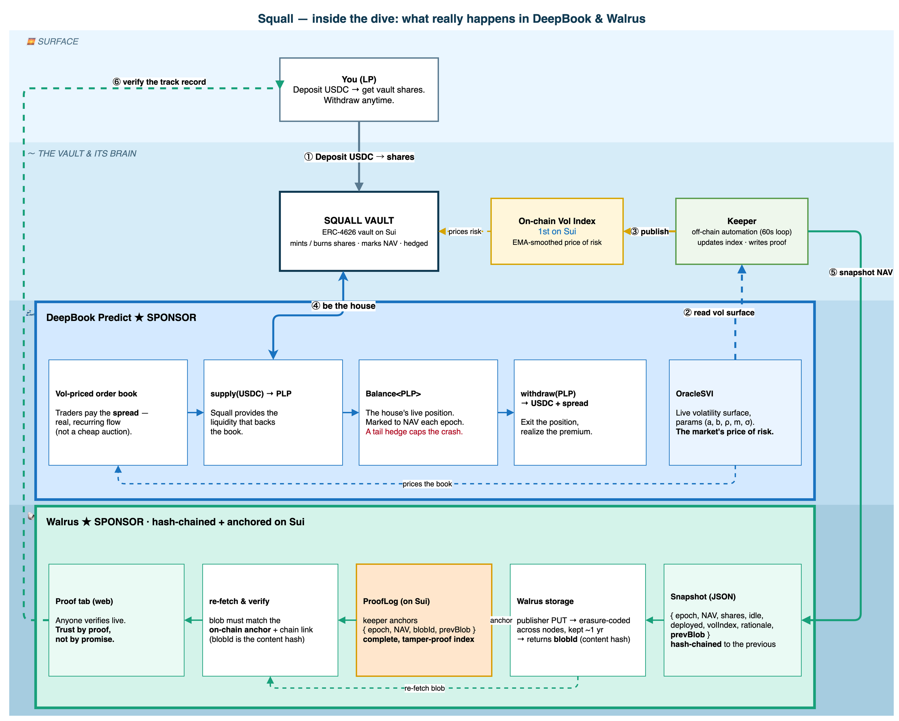

<div align="center">

# 🌀 Squall

**Structured yield on Sui, built on volatility.**

Tokenized ERC-4626 vaults on DeepBook Predict, powered by the **first on-chain volatility index on Sui**, with a hash-chained, on-chain-anchored performance record on **Walrus**.

[](https://suiscan.xyz/testnet/object/0xbc279cb0ce8622b5e27c787961b7b39a55ebea0cf6ad993bdea6a43bc55f3d9c)
[](https://sui.io)
[](https://walrus.xyz)
[](https://move-book.com)

</div>

---

## The problem

The first wave of DeFi option vaults (Ribbon, Friktion) did billions in volume, then collapsed in 2022. They died for two structural reasons:

- **Underpriced auctions.** Weekly options auctions sold too cheap, leaking value to market makers.
- **Naked vol selling.** Premiums were collected unhedged, so a single crash wiped out LPs and everyone left.

Picking up pennies in front of a steamroller.

## What Squall does

Squall rebuilds structured vaults on Sui with both failure modes fixed:

1. **Earn the spread, not a cheap auction.** The vault is a liquidity provider on **DeepBook Predict's** vol-surface-priced order book. It becomes *the house*, collecting the spread from real, recurring trading flow.
2. **Hedged by design.** A tail overlay caps the per-period loss, the exact crash that killed the old vaults.
3. **Provable, not promised.** Every vault action writes a snapshot to Walrus, hash-chained and anchored on-chain, so the track record can be independently verified rather than trusted.

No options knowledge required: deposit USDC, receive a vault share token, withdraw anytime.

---

## 🟢 Live on Sui testnet

The full cycle is verified end-to-end against the **real DeepBook Predict** package. See [`deployments/testnet.json`](deployments/testnet.json).

| Object | ID |
|---|---|
| Package | `0x6db7afe5caa78f6c1caedf6546b44af1b1bdc35f6f4f8f3062e3b675f7396d3f` |
| Vault (DUSDC / vSTRATA) | `0xbc279cb0ce8622b5e27c787961b7b39a55ebea0cf6ad993bdea6a43bc55f3d9c` |
| PredictStrategy | `0x32d8d720b6d2fc49b9c068151db0c84a9bdccc2e4856e8e476c95715213d9572` |
| VolIndex | `0x7521737597f1697c18cd4382a5ff43d62b89cef3667d1d8d02e48cdda9d67f0c` |

**Verified on-chain cycle:** `deposit 100 DUSDC → 100B vSTRATA` → `allocate 60 DUSDC into Predict PLP` → `divest → 60 DUSDC + NAV report` → `redeem → DUSDC out`, plus a live `vol_index` update (65%) and NAV snapshots stored, hash-chained, and re-verified on Walrus from the in-app Proof tab.

---

## How it works

Squall is one continuous dive, from the user at the surface, through DeepBook's depths, down to the Walrus seabed:

<div align="center">
  
</div>

1. **Price risk.** A keeper reads DeepBook Predict's `OracleSVI` volatility surface, computes the at-the-money implied volatility, and publishes it on-chain as the **Vol Index**, an EMA-smoothed, shared object that any protocol can read.
2. **Be the house.** The vault supplies USDC into DeepBook Predict's PLP pool through a capability-gated strategy, earning the option-seller premium, marked to NAV every epoch, with a tail hedge capping the downside.
3. **Prove it.** Each epoch the keeper writes a NAV snapshot to Walrus (immutable, content-addressed), embeds the previous snapshot's blob id to form a **hash-chain**, and anchors `{epoch, NAV, blobId, prevBlob}` on-chain in a `ProofLog`. The result is a track record that is complete (no epoch can be hidden) and tamper-evident.

---

## What Squall ships first on Sui

| First | What it is |
|---|---|
| 🧭 **On-chain volatility index** | A shared `VolIndex` object derived from DeepBook Predict's vol surface, readable by any protocol. The fair, on-chain price of risk on Sui. |
| 🏦 **Structured-yield vault** | Full ERC-4626 semantics in Move (`deposit / mint / withdraw / redeem` + previews + `convertTo*`), with virtual-offset inflation-attack protection. |
| 🔐 **Provable track record** | Hash-chained Walrus snapshots, anchored on-chain, verifiable by anyone. Trust by proof, not by promise. |

---

## Risk, backtesting, and honesty

> **Methodology.** The figures below come from a seeded simulation of the strategy logic (`sim/`), not an empirical fund track record. They demonstrate the strategy's *risk behaviour* (the hedge reduces drawdown). They are illustrative and reproducible, **not a yield guarantee. You can lose money.**

**Monte Carlo (1y, 1000 runs):** the hedge gives up a little APY to cut the tail.

| Strategy | APY | Max drawdown | Sharpe |
|---|---|---|---|
| Naive PLP (unhedged) | ~18.7% | 19.1% | lower |
| **Squall (hedged)** | ~17.7% | **16.5%** | higher |

- The hedge **lowered drawdown in 7 of 7 market regimes** in the robustness sweep (calm, normal, high-vol, thin/fat edge, conservative/aggressive sizing).
- **Real BTC history (~2.7 years, through a real 51% crash):** being the house held max drawdown to **~20% vs 51%** for holding BTC, while staying positive.

Run it yourself:

```bash
cd sim
pnpm backtest             # 1-year path + 1000-scenario Monte Carlo
pnpm stress               # robustness sweep, 7 regimes x 2000 runs
pnpm backtest:historical  # empirical backtest on committed real BTC data
```

---

## Monorepo layout

```
squall/
├── move/
│   ├── strata/                  # on-chain protocol (Sui Move 2024)
│   │   └── sources/
│   │       ├── math.move            # ERC-4626 conversion math + inflation guard
│   │       ├── access.move          # Admin / Keeper / Strategy capabilities (vault-bound)
│   │       ├── vstrata.move         # vSTRATA share token + treasury
│   │       ├── vault.move           # generic ERC-4626 vault core (Vault<A, S>)
│   │       ├── fees.move            # management + performance fees (high-water mark)
│   │       ├── vol_index.move       # on-chain volatility index (EMA-smoothed)
│   │       └── predict_strategy.move# DeepBook Predict PLP premium-harvest strategy
│   └── proof/                   # standalone on-chain anchor (ProofLog + writer cap)
├── packages/sdk/               # @strata/sdk: SVI vol math, Walrus blob I/O, constants
├── keeper/                     # off-chain automation: vol-index updater, snapshotter, anchorer
├── web/                        # Next.js app: landing, vault dashboard, proof tab, docs
└── sim/                        # backtests: naive vs hedged, Monte Carlo, real BTC
```

The vault core is **strategy-agnostic** (`Vault<A, S>`): the DeepBook-specific logic plugs in through a capability-bound strategy module, so the same vault works for any asset or strategy.

---

## Quickstart

**Prerequisites:** [pnpm](https://pnpm.io), Node 18+, and [Sui CLI](https://docs.sui.io/guides/developer/getting-started/sui-install) ≥ 1.73 (for the Move package).

```bash
# install workspace deps
pnpm install

# run the web app (landing + vault + proof tab)
pnpm --filter web dev        # http://localhost:3000

# off-chain tests (SDK + keeper)
pnpm -r test

# Move unit tests
cd move/strata && sui move test
```

Connect a Sui **testnet** wallet on the `/vault` page, grab dUSDC from the faucet, and deposit to mint vSTRATA. The Proof tab re-fetches each Walrus snapshot and verifies it against its on-chain anchor and chain link.

---

## Tech stack

- **On-chain:** Sui Move 2024 (ERC-4626 vault, capability security, shared objects)
- **Sponsors:** DeepBook Predict (vol-priced order book + OracleSVI), Walrus (decentralized storage)
- **Off-chain:** TypeScript keeper (`@mysten/sui`), SVI implied-vol math
- **Frontend:** Next.js + dapp-kit, deployed on testnet
- **Simulation:** seeded Monte Carlo + real-data backtests

---

## Roadmap

- [x] ERC-4626 vault core, fees, capabilities, vol index, integration tests
- [x] DeepBook Predict strategy, deployed and full-cycle verified on testnet
- [x] Walrus track record: hash-chained snapshots + on-chain `ProofLog` anchor
- [x] Backtests: Monte Carlo, regime sweep, real BTC
- [ ] Keeper auto-roll loop (event-driven, idempotent, resumable)
- [ ] Cumulative-drawdown hedge (protects slow multi-day declines)
- [ ] Mainnet launch

---

## Disclaimer

Squall is experimental software on testnet. The backtests are illustrative simulations, not a forecast or a yield guarantee. Real yield depends on actual on-chain trading volume and the implied-versus-realized volatility spread, which only emerge at scale on mainnet. Nothing here is financial advice. **You can lose money.**

---

<div align="center">

Built for **Sui Overflow 2026** · DeepBook Predict track · Walrus bounty

</div>
